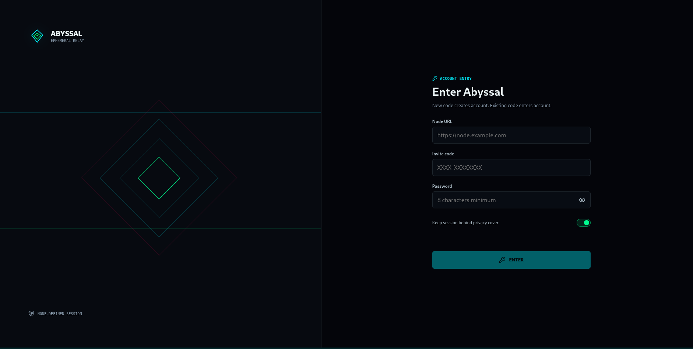

# Abyssal Chat

Abyssal is an ephemeral chat monorepo containing a native Android client, a browser client, a Rust relay, and a native crypto crate. Neither client hardcodes a node URL: account entry takes a node URL, access code, and password every time a process starts.

## UI Preview

The web client and Android client share the same Abyssal visual language: dark relay surfaces, restrained cyan/green status signals, RAM-only account entry, encrypted rooms, mentions, replies, GIF reactions, and media controls.



Android uses `FLAG_SECURE`, so production device screenshots are intentionally blocked instead of being used as README media.

## Monorepo Layout

```text
apps/web/        React + TypeScript browser client
android/         Kotlin + Jetpack Compose Android client
mirage-server/   Rust Axum relay (legacy directory name)
rust-core/       Native Rust crypto crate
deploy/          Docker, rsync, and service scripts
```

Root `package.json` owns the npm workspace. Root `Cargo.toml` and `Cargo.lock` own the Rust workspace. Existing Android and relay paths remain stable for deployment scripts.

## Storage Policy

- Android keeps account sessions, node URLs, chat sessions, message buffers, camouflage secrets, passwords, and encryption material out of app-owned persistent storage. Authenticated state lives only in the application process.
- Android and web cap decrypted message history at 500 messages or an estimated 8 MiB per chat, and 5,000 messages or an estimated 32 MiB globally, whichever limit is reached first. Eviction is deterministic and removes the oldest entries first. Eviction, expiry, and clearing wipe mutable attachment-key byte arrays and best-effort drop plaintext references. The estimates are deliberately conservative accounting bounds, not physical-memory measurements: immutable JVM/JavaScript strings and the OS/runtime may retain copies that application code cannot reliably zeroize.
- `Remember this session` keeps that RAM-only session alive across activity pause, stop, and activity recreation while the Android process remains alive. With calculator camouflage enabled, leaving the app shows the calculator cover without logging out. When unchecked, leaving the foreground ends the session.
- Every authenticated session has a strict node-provided inactivity deadline. User interaction refreshes it; background time and time spent behind the calculator cover do not. Expiry clears local RAM state, disconnects transport, and requires account entry again. Process death, explicit logout, wipe, or relay restart also clears session state.
- Explicit logout and client-side expiry also make a best-effort relay call to revoke the bearer token immediately. The relay independently rejects expired tokens and closes idle WebSockets, so client enforcement is not the only boundary.
- The calculator cover supports a normal unlock PIN and an optional duress PIN. The duress PIN silently purges local memory and attempts a relay wipe, but the operation is stamped to the captured account so a stale evaluation cannot wipe a replacement login.
- Camouflage has no default PIN and is never recoverable from disk. Android resets the stale calculator launcher alias and the RAM-only PIN after process death; configure a new camouflage PIN after signing in to a fresh process.
- The relay stores generated codes, OPAQUE password records, encrypted identity envelopes, sessions, rooms, clients, presence, and pending recipient-specific ciphertext in RAM only. Pending frames are keyed by conversation and intended username so one participant cannot consume another participant's offline queue. Pending frames expire after a bounded configurable lifetime (default 24 hours, accepted range 1-168 hours; `0` is clamped, never unbounded), and expiration also releases any matching prekey lease. Restarting the relay, an authenticated user wipe, or the dead-man switch clears all relay account and chat state.
- Files, images, and videos may only be written to disk through an explicit user save flow. Android and web authenticate and decrypt attachments in memory, then save the original bytes under a sanitized original filename. One-time attachments remain view-only and expose no save control.
- Android software updates are a second explicit disk-write flow. After the user selects Update, Abyssal downloads the signed release APK into private cache, enforces the manifest size, verifies its SHA-256 digest, and grants Android's package installer temporary read access. Failed or stale update files are deleted; account, message, password, token, and key material never enter that cache.
- Attachment plaintext limits are 20 MiB for images, 100 MiB for videos, and 200 MiB for other files. Cipher v2 splits bulk data into independently authenticated 256 KiB plaintext chunks. Each fixed 262,201-byte XChaCha20-Poly1305 record authenticates its version, index, count, exact total plaintext length, message context, and per-record nonce; the final chunk receives random padding before encryption. Clients encrypt and decrypt one record at a time, wipe mutable working buffers, and never retain a complete plaintext and ciphertext copy together. The bulk key is delivered inside encrypted message metadata; the relay stores and streams only opaque fixed records. The record count still reveals a 256 KiB size bucket. A default 320 MiB encrypted-RAM quota applies per account in addition to the global RAM limit, with bounded upload and download concurrency. Android applies a heap-aware limit before allocating the final decrypted output.
- Upload admission requires the same generated message ID that is bound into the encrypted metadata. The relay validates the complete ordered cipher-v2 record structure before storing the blob in a staged record that is non-downloadable to every user; staged records count against existing byte and record quotas, expire after a 10-minute deadline clamped to final retention, and are swept every 30 seconds. After replay/state acceptance, the exact authenticated owner/chat/message transaction promotes the matching record server-side before fanout and result emission. Rejected, rolled-back, or never-sent messages do not publish it; an accepted message whose result is lost still publishes it. Duplicate live owner/chat/message bindings are rejected without replacing ciphertext. Direct attachment metadata remains protocol v9, while room metadata is carried inside protocol-v10 MLS applications.
- `Delete after download` and one-time attachments are destructive only after the client receives the exact non-empty ciphertext, authenticates and decrypts it, then explicitly completes its recipient-bound claim. In a DM each intended recipient gets one completion; in a room the eligible recipients are snapshotted at upload and each can complete once. Failed, truncated, interrupted, cancelled, or unauthenticated transfers release the claim for retry exactly once, including late responses; transfer buffers and attachment secrets are wiped. Concurrent claims by the same recipient are rejected; and the owner can preview their upload without consuming a recipient claim. The relay removes the encrypted blob and releases quota only after every eligible recipient completes, or when the configured retention policy expires it.
- Every Android attachment upload, download, delete, completion, and claim release uses its captured `NodeSession`; accepted publication additionally requires the captured account, connection generation, and repository epoch to remain current. Stale publication is rejected and attachment secrets are wiped.
- Attachment upload cleanup is owner-scoped: if metadata encryption or local WebSocket enqueue fails after blob upload, the client immediately deletes the staged relay record and releases its RAM quota. The cleanup endpoint accepts only the uploading account; it cannot delete another account's attachment. A process or connection loss before message acceptance can leave a non-downloadable staged record until the deadline and sweeper, with a worst-case cleanup window of about 10.5 minutes. An accepted message whose result is lost still publishes its encrypted attachment under normal retention. The client cannot recall published or in-flight bytes, including bytes already handed to the operating-system or network kernel, and a hostile recipient can record decrypted content.
- There is no Room, SQLite, DataStore, SharedPreferences, or app-owned message database.
- Bundled static UI assets, including GIF reactions, are packaged with the APK. They are not user messages or account/session state.
- The web client never calls `localStorage`, `sessionStorage`, IndexedDB, Cache Storage, cookies, or a service worker. Account state, messages, PINs, decrypted media URLs, and crypto keys live in the current JavaScript process only. Relay responses use `Cache-Control: no-store`. Android and web bound picker results, catalog entries, identity pins, replay IDs, and own-message indexes; stale picker callbacks cannot upload after their lifecycle token expires, and malformed room/presence catalogs are rejected as a whole.
- Presence carries a V2 directory checkpoint bound to the authenticated node ID, monotonic append-only account-map revision, and sorted username-to-stable-64-byte-identity map. Web and Android recompute it and retain at most 32 checkpoints in RAM. Exact-current relay admission and matching authenticated inner/outer stamps for text, attachment metadata, and read receipts fail closed on conflicts, cross-node/newer/altered replays, or mismatches; evicted unknown-old frames are dropped before ACK/publication. This is equivocation detection among communicating clients, not external transparency: no signed append-only witness exists, partitioned clients can evade gossip, RAM-only history resets the anchor, and the 32-entry cap can cause availability drops.
- Direct chats remain `NOT COMPARED` until the user explicitly confirms that the displayed safety number exactly matches a value obtained through a separate channel. On Android and web, direct text, GIF/media upload, attachment view/export/save, and network read receipts require that session-scoped confirmation. Incoming unverified direct text may still display and be marked read locally, but it emits no read receipt. Confirmation is a user assertion, not independent authentication or a witness: trust stays in RAM for at most 128 peers and is keyed to the direct context, both stable identity prefixes (the first 64 bytes), and the session and connection generations. Rotating prekeys are not part of that key, so prekey rotation does not clear trust. Reconnect, identity change, logout, wipe, expiry, process/page teardown, or bounded-store eviction clears it. Rooms use protocol-v10 MLS; this direct safety-number gate does not provide room participant verification or an external transparency witness.
- With `Remember this session`, Android activity pause/stop retains the RAM session; camouflage may lock or hide the UI and clear its preview while in-flight session work remains generation-scoped. An unchecked lifecycle exit, logout, expiry, wipe, or process/page teardown invalidates and cancels applicable work, revokes temporary media URLs, and rejects stale callbacks. Android outbound text and read-receipt operations share a bound of 64, carry the captured app generation and identity, and are cancelled on logout, expiry, or wipe. Room/direct catalog events use a bounded, drainable 1,152-event channel tagged with connection generation; disconnect drains it and stale-session events are rejected. Repository mutations carry a monotonic in-memory epoch and reject stale epochs after synchronous purge.
- Android inbound ciphertext and room/direct catalog queues are bounded and connection-generation tagged. Overflow closes the socket and requires reconnect/resync; invalidation drains queued events, wipes ciphertext buffers, and rejects stale callbacks. Commands, sends, and ACKs are connection-generation-bound and cannot reach a replacement socket. A carried global-wipe signal survives same-account reconnect, while explicit logout drains pending wipe and queued work.
- Post-native-decrypt wrapper, schema, or state-install failures clear local identity and fail closed; authentication failures before native return remain ordinary drops. Abnormal socket invalidation clears socket-scoped joins, catalogs, and identity authorization before reconnect.
- The relay bounds live outbound WebSocket buffering at 4 MiB per client and 64 MiB globally. Slow consumers are rejected or closed before queued encrypted frames can grow without bound; purge control has a separate priority path.
- Every WebSocket application frame is padded in both directions. Direct protocol-v9 messages use strict buckets of `4096`, `16384`, `65536`, `262144`, or `1048576` bytes. Non-message control and MLS frames use a terminal transport-padding suffix; MLS controls may also use `4194304`, `16777216`, or `17825792` bytes. Relay, web, and Android reject missing, malformed, nonterminal, noncanonical, truncated, or oversized padding before domain state and count complete padded bytes in rate, fanout, pending, and outbound-queue budgets. Only canonical `mls_*` controls may use the larger limits. This does not pad HTTP attachment bodies, hide timing/count/routing/participants/attachment sizes/bucket choice, or add cover traffic. JSON property order is not a security contract. Older clients that omit control padding are wire-incompatible even though the inner crypto protocols remain unchanged.
- Direct message, acknowledgement, MLS room, and MLS snapshot mutations have exact idempotent recovery. The relay finalizes a bounded RAM-only receipt before delivering each terminal result. Android and web retain only the exact serialized encrypted transaction for a 30-second recovery window and resend those same bytes after a same-account transport reconnect. Exact duplicates replay the result without repeating state mutation or fanout; conflicting bytes under the same account/operation/conversation/message identity invalidate the connection. Receipts expire, are capacity bounded, and disappear on wipe or relay restart. This prevents accidental ratchet divergence after a lost result; it cannot prevent a malicious relay from denying service.
- Browser engines may still page process memory to disk, retain implementation caches, expose data to privileged extensions, or allow OS capture. Web pages cannot provide Android `FLAG_SECURE` guarantees. Read [SECURITY.md](SECURITY.md) before treating Abyssal as a high-security system.

## Credits

The bundled GIF reaction pack came from ECA, [`EraseableChatApp`](https://github.com/i-vt/EraseableChatApp), by [@i-vt](https://github.com/i-vt). We adapted those assets for Abyssal's encrypted in-chat GIF picker.

Asset licensing details are in [THIRD_PARTY_NOTICES.md](THIRD_PARTY_NOTICES.md).

## Android

Build a debug APK:

```bash
cd android
./gradlew :app:assembleDebug
adb install -r app/build/outputs/apk/debug/app-debug.apk
```

The install command expects `adb` on `PATH`. Otherwise invoke `platform-tools/adb` from your Android SDK.

At the entrance screen enter:

- Node URL, for example `https://chat.example.com`. Plain HTTP is accepted only for loopback development addresses such as `127.0.0.1` and the Android emulator host `10.0.2.2`.
- Code printed by the relay process at startup.
- Password. Creating an account consumes the code; later logins use the same code and password while the relay process is still alive. A second login is rejected while that code still has an unexpired session.
- `Remember this session` is optional and never stores the code, password, URL, or token on disk. It only changes lifecycle behavior for the current process.

For an Android emulator talking to a server on the development machine, use `http://10.0.2.2:4020`.

### Chat behavior

- Text and media messages can reply to any message still present in the current RAM buffer. Tap the reply icon beside a bubble, then send text, a file, an image, a video, or a bundled GIF.
- Reply envelopes contain only the original message ID inside the encrypted payload. They do not copy the original plaintext, filename, or sender. If the original expires, the reply renders `Original message unavailable` instead of extending the original content's lifetime.
- Tapping an available reply preview scrolls to and briefly highlights the original message. The composer automatically cancels a reply if its target expires before send.
- Every bundled reaction has a `:filename:` shortcut, such as `:fire:`. Picker and shortcut sends use the same encrypted attachment path and render in equal-size inline frames on Android and web.
- Type `@` to complete a connected username, or tap a sender name to mention them. Mentions and replies to one of the current process's own message IDs receive recipient-only attention styling.
- The composer remains editable while reconnecting, but send and attachment actions stay disabled until the WebSocket is connected so a local bubble is not mistaken for a relayed message.
- The chat initially opens at the latest active message and follows new messages only while the user remains near the bottom.
- Direct messages appear under `DIRECT`. Select a peer in the live presence rail to ask the relay for a canonical private conversation; guessed DM identifiers are rejected by the relay.
- Direct headers display a symmetric safety number derived from both identity keys. Both participants see the same number and should compare it through a separate channel; an exact user confirmation is required before direct sends, attachment access/export, or network read receipts.
- Direct composers choose retention for each text, GIF, or attachment: `Never`, `5s`, `10s`, `30s`, or `1m`. `Never` means retained only for the current client/relay RAM lifetime; restart, wipe, logout, or process loss still removes it.
- Room creators may set any after-read timer to `0` for no read-triggered expiry. Room policy is locked for participants, including text and media-specific timers; a sender cannot extend it from the composer.
- Android checks the latest stable GitHub release after launch without caching metadata to disk. A newer signed universal APK opens in the system browser only after explicit confirmation; users can cancel for the process lifetime or request an in-memory reminder two hours later. The prompt never appears over the calculator cover.

### Signed release build

Create and securely back up a signing key once:

```bash
./scripts/create-android-release-key.sh
```

Then build and verify the signed universal APK and AAB:

```bash
ANDROID_SDK_ROOT="$HOME/Android/Sdk" ./scripts/build-android-release.sh
```

The ignored `deploy/release.env` and `.secrets/abyssal-release.jks` are both required to sign future compatible updates. `deploy/release.env` is literal data with exactly four signing assignments; the build parses it without shell evaluation and requires owner-only permissions on both files. Full release steps are in [docs/RELEASE.md](docs/RELEASE.md).

## Web

Install and run the browser client:

```bash
npm ci
npm run web:dev
```

For local cross-origin development, start the relay from the repository root with the exact Vite origin:

```bash
ABYSSAL_WEB_ORIGINS=http://localhost:4173 cargo run --package mirage-server
```

Open `http://localhost:4173`, then enter `http://127.0.0.1:4020` as the node URL. Production Docker builds the web client and serves it from the relay root, so a URL such as `https://chat.example.com/` and the API use one origin. Leave `ABYSSAL_WEB_ORIGINS` empty for that deployment.

Web client behavior:

- Account entry automatically creates an account for an unused code or logs into its existing RAM account. Each account request body is capped at 16 KiB; OPAQUE handshakes expire after 60 seconds and code attempts are rate-limited to six per minute.
- Rooms, owner quotas, room media policy, live presence, encrypted messages, replies, read expiry, absolute expiry, GIFs, upload progress, images, videos, and explicit attachment downloads use the existing relay protocol. Dashboard room and DM entries never render message plaintext.
- Web room names, usernames, message bubbles, reply previews, GIFs, attachment summaries, and decrypted media are visually blurred until pointer hover or keyboard focus. This is a shoulder-surfing control, not encryption or a browser screenshot defense.
- Existing DMs are listed in the sidebar. Select any other account in `DIRECT` or the live presence rail to create/open the canonical pairwise conversation. The relay sends DM frames only to its two participants and rejects unauthorized joins and attachment requests.
- Every bundled reaction has a `:filename:` shortcut, such as `:fire:`. Picker reactions carry a validated shortcut inside encrypted attachment metadata and render in equal-size inline frames without exposing the selection to the relay.
- Type `@` to complete an active or offline username. Mentions and replies to one of the current process's own message IDs receive the same recipient-only attention treatment; other users do not see that highlight.
- Direct composers apply a per-message `Never`, `5s`, `10s`, `30s`, or `1m` timer to text, GIFs, and attachments. Room composers show the creator's locked room timer; room policy can also be configured as no read expiry.
- The calculator cover PIN and optional duress PIN exist only in the current tab. Reload, tab close, logout, wipe, session expiry, or process termination loses them.
- WebSockets use a negotiated `abyssal-v2` plus a random 32-byte `ticket.*` subprotocol. Tickets are issued by authenticated `POST /v1/ws-ticket`, expire after 30 seconds, are stored only as digests, and are single-use; bearer tokens are rejected in WebSocket subprotocols. Protocol-v9 E2EE with per-recipient signatures, signed ratchet state, bounded revisions, mandatory message/control transport buckets, a 608-byte public bundle (stable 64-byte identity portion, 16 canonical 32-byte one-time keys covered by the signed identity bundle, and a 32-byte fallback key), recipient-bound prekey leases, and ratcheted metadata requires Abyssal `2.2.0` clients plus matching web/Android transport implementations. Protocol-v8 shapes/checkpoints fail closed, as do older pre-v8 clients; all are wire-incompatible with v9.

Run web checks:

```bash
npm run web:check
```

## Verification

Run the complete repository suite from the root:

```bash
./check.sh all
```

Targeted modes are available for `quick`, `web`, `rust`, `android`, `android-package`, `integration`, `crypto`, `audit`, and `shell`. Full mode runs web lint/unit/component/build checks, Rust formatting/tests/clippy, Android JVM tests/release lint/Kotlin compilation without APK or AAB packaging, shell syntax checks, a live disposable-relay OPAQUE/ratcheted-E2EE DM/offline-replay/access-control integration test, and npm/RustSec dependency advisory scans. `android-package` is an explicit packaging-only gate. `crypto` regenerates the shared WASM, Kotlin, and four stripped Android ABI libraries, then records a deterministic digest of their Rust inputs. Normal, full, and signed-release checks reject protocol-v8 or stale generated artifacts.

Release builds additionally require an offline Ed25519 provenance key and a signed `release-manifest-v1.json`. The relay admits only the exact Android/web version and build signature named by its current verified RAM manifest. Web verifies its origin-served bundle before account entry; Android verifies its baked build identity and any downloaded update. The repository intentionally ships with an unusable zero production root until the one-time public-key ceremony is completed, so ordinary builds fail closed instead of silently trusting a placeholder. See [docs/RELEASE.md](docs/RELEASE.md) and [SECURITY.md](SECURITY.md).

The 2026-08-25 integrated gate ran 350 web tests across 31 files, 67 Rust-core tests, 15 release-tool tests, 230 relay tests, and 241 Android JVM tests. Web lint/build, Rust formatting and warning-denied Clippy, the forbidden integration-root release compile check, Android release lint/debug and release compilation, live disposable-relay integration with strict build admission, generated-artifact and deployment checks, and npm/RustSec audits passed. No Android packaging task was invoked; the applicable tests had zero skips, failures, or errors.

Security-sensitive build inputs are pinned and checked: Rust `1.97.1`, Gradle `8.7` plus its wrapper/distribution hashes, Android NDK `27.3.13750724`, `wasm-bindgen-cli` `0.2.126`, and `cargo-ndk` `4.1.2`. Gradle resolves against tracked SHA-256 dependency-verification metadata. CI action revisions and Docker image/frontend digests are immutable. A separate CI job regenerates every WASM/JNI binding and rejects any byte-level difference from the tracked artifacts. Dependabot covers Cargo, npm, Gradle, Actions, and Docker; advisory scans and CodeQL cover the supported Rust and JavaScript/TypeScript surfaces. Docker build context rules exclude local toolchains, deployment configuration, npm credentials, and release keystores before data reaches the builder.

## Rust Server

Run locally:

```bash
cd mirage-server
ABYSSAL_BIND_ADDR=0.0.0.0:4020 \
ABYSSAL_NODE_ID=abyssal-node-1 \
ABYSSAL_CODE_COUNT=8 \
ABYSSAL_ATTACHMENT_RAM_LIMIT_MB=512 \
ABYSSAL_ATTACHMENT_ACCOUNT_LIMIT_MB=320 \
ABYSSAL_ATTACHMENT_RECORD_LIMIT=16384 \
ABYSSAL_ATTACHMENT_ACCOUNT_RECORD_LIMIT=4096 \
ABYSSAL_ATTACHMENT_MAX_LIFETIME_HOURS=168 \
ABYSSAL_ATTACHMENT_DOWNLOAD_CONCURRENCY=2 \
ABYSSAL_ATTACHMENT_UPLOAD_CONCURRENCY=2 \
ABYSSAL_MAX_ROOMS_PER_USER=5 \
ABYSSAL_PENDING_MESSAGE_TTL_HOURS=24 \
ABYSSAL_SESSION_INACTIVITY_MINUTES=15 \
ABYSSAL_INACTIVITY_LIMIT_HOURS=0 \
ABYSSAL_ALLOW_ANDROID_TO_WEB=false \
ABYSSAL_ALLOW_WEB_TO_ANDROID=true \
cargo run --release
```

Health check:

```bash
curl http://127.0.0.1:4020/health
```

The server prints generated access codes once to attached stdout during boot. Each code has a random variable length of at least 12 characters including dashes, can create exactly one RAM-only account, and is never written to a relay file or Docker log. After printing, plaintext code buffers are zeroized and the relay retains only per-process HMAC identifiers; account, session, client, rate-limit, and room-owner maps never retain plaintext codes. Fixed invite codes cannot be supplied through environment variables. There are no administrator roles or privileged codes. Only one unexpired bearer session may exist for a code at a time. If the operator loses terminal output, codes are deliberately unrecoverable through supported interfaces; restarting the relay destroys all RAM state and creates a new set.

Every authenticated user can create rooms and trigger a relay RAM wipe. Rooms are owned by their creator: only that account can update or delete them. `ABYSSAL_MAX_ROOMS_PER_USER` limits each account's active rooms, and deleting an owned room releases one slot.

This is an intentional availability tradeoff: a compromised account can wipe the relay and force destructive restart/code rotation. Keep active account sessions and the wipe confirmation protected.

Security-related relay knobs:

- `ABYSSAL_ATTACHMENT_RAM_LIMIT_MB`: total in-memory encrypted attachment budget. Default: `512`.
- `ABYSSAL_ATTACHMENT_ACCOUNT_LIMIT_MB`: per-account in-memory encrypted attachment quota, capped by the global RAM limit. Default: `320`.
- `ABYSSAL_ATTACHMENT_RECORD_LIMIT`: global encrypted attachment-record quota. Default: `16384`; accepted range: `1` to `65536`.
- `ABYSSAL_ATTACHMENT_ACCOUNT_RECORD_LIMIT`: per-account encrypted attachment-record quota. Default: `4096`; accepted range: `1` to `65536`, then capped by the global record limit. Record quotas count the authoritative bounded attachment map and are separate from byte quotas; expiry, deletion, completion cleanup, room cleanup, and global wipe free record capacity.
- `ABYSSAL_ATTACHMENT_MAX_LIFETIME_HOURS`: hard relay-side maximum lifetime for every encrypted attachment, including an explicit `ttl=0`/no-expiry request. Default: `168` hours (7 days); accepted range: `1` to `720` hours. Room absolute-expiry rules may shorten this value, never extend it. Expired blobs are removed from RAM and release quota.
- `ABYSSAL_ATTACHMENT_DOWNLOAD_CONCURRENCY`: maximum concurrent attachment responses across the relay. Default: `2`; accepted range: `1` to `16`.
- `ABYSSAL_ATTACHMENT_UPLOAD_CONCURRENCY`: maximum concurrent attachment request-body reads. Default: `2`; accepted range: `1` to `4`. This bounds large encrypted request allocations before the RAM quota check.
- `ABYSSAL_MAX_ROOMS_PER_USER`: active room quota for each account. Default: `5`; accepted range: `1` to `100`.
- `ABYSSAL_PENDING_MESSAGE_TTL_HOURS`: maximum RAM lifetime for an undelivered encrypted pending frame. Default: `24`; accepted range: `1` to `168` hours. `0` is clamped to the one-hour minimum and never means unbounded. Expired frames are removed, their byte budget is returned, and matching prekey leases are released together.
- `ABYSSAL_SESSION_INACTIVITY_MINUTES`: strict bearer-token and WebSocket inactivity limit. Default: `15`; accepted range: `1` to `1440`. The Android client displays the node policy and enforces the same deadline locally.
- `ABYSSAL_INACTIVITY_LIMIT_HOURS`: dead-man switch. `0` disables it. A positive value wipes relay RAM state and broadcasts `GLOBAL_WIPE` after that many idle hours.
- `ABYSSAL_ALLOW_ANDROID_TO_WEB`: permits Android-origin direct messages, MLS room applications, pending delivery, and attachments to web recipients. Default: `false`.
- `ABYSSAL_ALLOW_WEB_TO_ANDROID`: permits web-origin direct messages, MLS room applications, pending delivery, and attachments to Android recipients. Default: `true`.
- Platform delivery values accept only exact `true` or `false`; invalid values stop relay startup. Same-platform delivery is always allowed. The platform comes from the signed build attestation consumed by the authenticated session's first one-time WebSocket ticket, not from an editable message field. That session cannot switch platform without a fresh OPAQUE login. Unknown recipient platforms and forbidden mixed-platform fanout fail closed before publication. The policy constrains honest signed clients admitted by an honest relay; it is not hardware attestation and cannot constrain a client or relay an attacker has patched.
- `ABYSSAL_WEB_ORIGINS`: comma-separated exact browser origins allowed to call the relay cross-origin and open WebSockets. Leave empty when web and relay share one origin.
- `ABYSSAL_WEB_ROOT`: optional built web directory containing `index.html`. Docker sets this to `/opt/abyssal/web`.

The relay accepts transport-padded WebSocket dummy controls whose stripped domain shape is `{"type":"dummy","padding_b64":"..."}` and discards them before room routing. This supports future optional cover traffic without polluting message queues, but no client currently schedules constant-rate cover traffic.

Relay `ack_result` acceptance requires exactly one matching pending recipient frame and, for a leased first-contact frame, its matching lease, with the signed recipient state mutation and frame removal completed before the result is emitted.

Android and web use the same Rust core. Account creation/login uses OPAQUE, so the password is not sent as relay application data. Registration also proves possession of the generated Ed25519 identity key over a fresh server challenge and the exact identity upload before the one-time code is consumed. Direct protocol v9 uses ChaCha20-Poly1305, recipient-specific authenticated Olm Double Ratchet envelopes, Ed25519 envelope/state signatures, bounded revision replay protection, and recipient-bound one-time-prekey leases. The relay receives ciphertext and signed public/state metadata, never message or attachment plaintext or ratchet secrets.

Direct sender and recipient state is transactional. The relay atomically admits complete fanout, applies authenticated acknowledgement state, and finalizes a bounded RAM-only exact-frame receipt before attempting result delivery. Android and web retry only the identical serialized encrypted transaction for at most 30 seconds across a same-account reconnect. An exact duplicate replays the original terminal result without repeating fanout or mutation; changed bytes under the same account, operation, conversation, and message identity invalidate the connection. Capacity or recovery-deadline exhaustion fails closed. First-contact lease requests are not treated as recoverable mutations, and clients release only leases definitely known to be unused. `message_result`, `ack_result`, `mls_room_result`, and `mls_snapshot_result` prove relay delivery/state durability, not that a human read a message.

Plaintexts use authenticated 256-byte length buckets, while complete direct encrypted message frames use canonical `4096`, `16384`, `65536`, `262144`, or `1048576` byte transport buckets. Attachment cipher v2 streams fixed 256 KiB authenticated plaintext chunks with random final-record padding; each record binds its order, exact total length, message context, and nonce. Protocol-v10 rooms use RFC 9420 MLS with bounded membership, epoch, replay, snapshot, and queue state. Presence carries a stable long-term identity directory checkpoint, and direct chats require out-of-band safety-number/QR verification before sensitive actions. Live queues, pending data, attachments, transaction receipts, and replay state are finite and RAM-only; wipe clears them, and relay restart destroys them. Protocol-v8 shapes fail closed. External key transparency, multi-device coordination, persistent rollback anchors, and an independent Abyssal audit remain absent. See [SECURITY.md](SECURITY.md) for exact constructions, limits, and threat assumptions.

Protocol-v10 rooms use RFC 9420 MLS through exact `mls-rs 0.55.4` and `mls-rs-crypto-rustcrypto 0.22.1`. Owner-approved key-package joins produce Welcome messages; additions and removals advance the MLS epoch and authenticated roster. Sender state commits only after an exact accepted `mls_room_result`, and recipient application/control state commits only after an exact accepted `mls_snapshot_result`. Reconnecting members recover sealed RAM-only snapshots and queued ciphertext, remain blocked from sending while `synchronized=false`, and resume only after exact acknowledgements plus a fresh current catalog. Relay and clients bound rooms, members, replay IDs, state, queued deliveries, and offline lifetime. A delivery gap beyond the MLS implementation's 1,024-generation back-history drops the undecryptable queued tail and requires a membership epoch refresh. Relay never receives MLS group secrets or room plaintext.

This room protocol is not a Signal-grade claim. The selected RustCrypto MLS provider is marked experimental, `mls-rs` and Abyssal have no independent cryptographic audit, and external key transparency, multi-device coordination, and persistent rollback anchors remain absent. See [SECURITY.md](SECURITY.md).

## Docker

The relay can run cleanly in Docker. Build stages compile the web bundle and Rust relay. The minimal runtime image contains the static web bundle and compiled relay; the relay binary performs its own loopback health check without `curl` or a package-manager install. It runs as a non-root user with a read-only filesystem, bounded memory/PIDs, disabled Docker log persistence, disabled core dumps, and no database volume. Compose binds `4020` to loopback so a local Cloudflare tunnel or reverse proxy can reach it without exposing plaintext HTTP publicly. The Compose memory default is `2g` to leave headroom for the 512 MiB global attachment pool, which already accounts for stored blobs and in-flight upload/download references, plus runtime overhead; set `ABYSSAL_CONTAINER_MEMORY_LIMIT` before `docker compose` when sizing a different host. Attachment uploads have a 30-second idle deadline and a 10-minute total deadline, while stalled download producers release their buffers and permits after 30 seconds. Automatic restart is deliberately disabled: a crash must remain visible, because restarting creates a new invite-code set that is only recoverable from the operator's attached stdout.

Docker is the supported launcher. A systemd unit is intentionally not shipped: journald would persist one-time startup codes and relay metadata, while a hidden restart could generate an unrecoverable fresh code set. Keep Docker's `none` log driver and disabled automatic restart unchanged.

```bash
cp mirage-server/.env.example mirage-server/.env
$EDITOR mirage-server/.env
./deploy/server-start.sh
curl http://127.0.0.1:4020/health
```

The public health response contains only liveness, node identity, and the RAM-only storage label; invite and account counts are not exposed.

Stop it:

```bash
docker compose -f deploy/docker-compose.yml down
```

Do not put production codes in the Dockerfile. Configure only counts and node settings in `.env` or your server secret manager. The process prints codes once to attached stdout. The supplied Compose file uses Docker's `none` log driver, so startup credentials are not retained in host container logs. Terminal scrollback is the operator's only copy and must be protected or cleared after distribution.

## Remote Docker Deploy

The remote helpers read SSH settings from environment variables or the ignored `deploy/deploy.env` file. Create a local configuration from the tracked template:

```bash
cp deploy/deploy.env.example deploy/deploy.env
$EDITOR deploy/deploy.env
```

Before the first connection, establish host-key trust out of band. Obtain the
server's SSH host-key SHA-256 fingerprint from the provider console or a
trusted administrator, then place the matching host-key line in the configured
`ABYSSAL_SSH_KNOWN_HOSTS` file and verify it with:

```bash
ssh-keygen -F chat.example.com -f "$HOME/.ssh/known_hosts"
```

The file must already exist and be readable. The helpers require
`StrictHostKeyChecking=yes`, `BatchMode=yes`, and `IdentitiesOnly=yes`; they
fail closed when the host is absent or changes. Do not use an unauthenticated
`ssh-keyscan` result or an `accept-new` policy to trust a first connection.

Sync the repo and rebuild/restart Docker on the server:

```bash
./deploy/deploy-server.sh
```

The first deploy creates `mirage-server/.env` from the tracked template with mode `600`. Later syncs preserve that file and its node-specific settings. Review it on the server before issuing production invite codes.

Run that command from your local machine, not from inside the server shell. It uses SSH and rsync to reach the configured remote host.

If you are already SSH'd into the server at `/home/ubuntu/abyssal`, use the server-local scripts instead:

```bash
./deploy/server-start.sh
./deploy/server-restart.sh
./deploy/server-status.sh
./deploy/server-stop.sh
```

`server-logs.sh` is a compatibility alias for the status/health check. The
Compose service uses Docker's `none` log driver, so there are no persistent
container logs to retrieve. Keep the startup terminal attached when rotating
invite codes.

Run only the sync:

```bash
./deploy/sync-server.sh
```

Run only the Docker rebuild/restart:

```bash
./deploy/restart-docker.sh
```

Check container status and the built-in health probe without persistent logs:

```bash
./deploy/logs-docker.sh
```

Despite its historical name, `logs-docker.sh` reports `docker compose ps` and
the container/health state through `server-status.sh`; it never attempts to
read Docker logs. A failing status means the operator must inspect the
attached startup terminal, not recover codes from a log store.

Invite codes cannot be retrieved after startup. This command explains the destructive recovery path and exits:

```bash
./deploy/invite-codes.sh
```

To generate new codes, restart the relay. This destroys all accounts, rooms, pending messages, attachments, and sessions:

```bash
./deploy/restart-docker.sh
```

Stop the server:

```bash
./deploy/stop-docker.sh
```

Equivalent raw `rsync` command (the helper above is preferred because it
performs these checks automatically):

```bash
SSH_HOST=ubuntu@chat.example.com
SSH_KEY="$HOME/.ssh/abyssal"
KNOWN_HOSTS="$HOME/.ssh/known_hosts"
REMOTE_DIR=/home/ubuntu/abyssal
[[ "$SSH_HOST" =~ ^[A-Za-z_][A-Za-z0-9._-]*@([A-Za-z0-9._-]+|\[[A-Fa-f0-9:]+\])$ ]] || exit 1
[[ "$REMOTE_DIR" =~ ^/([A-Za-z0-9._~+-]+/)*[A-Za-z0-9._~+-]+$ ]] || exit 1
case "$REMOTE_DIR" in */*//*|*/./*|*/../*|*/.|*/..) exit 1 ;; esac
[[ -f "$SSH_KEY" ]] || exit 1
[[ -f "$KNOWN_HOSTS" && -r "$KNOWN_HOSTS" ]] || exit 1
printf -v SSH_COMMAND 'ssh -o BatchMode=yes -o IdentitiesOnly=yes -o StrictHostKeyChecking=yes -o UserKnownHostsFile=%q -i %q' "$KNOWN_HOSTS" "$SSH_KEY"
printf -v REMOTE_RSYNC_PATH 'mkdir -p -- %q && rsync' "$REMOTE_DIR"
SYNC_DIR="$(mktemp -d)"
trap 'rm -rf "$SYNC_DIR"' EXIT

git archive --format=tar HEAD | tar -xf - -C "$SYNC_DIR"

rsync -az --delete \
  -e "$SSH_COMMAND" \
  --rsync-path="$REMOTE_RSYNC_PATH" \
  --exclude '.git/' --exclude '.secrets/' --exclude 'README.local.md' \
  --exclude 'deploy/deploy.env' --exclude 'deploy/release.env' \
  --exclude 'mirage-server/.env' \
  "$SYNC_DIR/" "$SSH_HOST:$REMOTE_DIR/"
```

Override the target without editing scripts:

```bash
ABYSSAL_SSH_HOST=ubuntu@chat.example.com \
ABYSSAL_SSH_KEY="$HOME/.ssh/abyssal" \
ABYSSAL_SSH_KNOWN_HOSTS="$HOME/.ssh/known_hosts" \
ABYSSAL_REMOTE_DIR=/home/ubuntu/abyssal \
./deploy/deploy-server.sh
```

Command-line environment values override `deploy/deploy.env`. Set `ABYSSAL_DEPLOY_ENV` to use a different local configuration file.
The helpers validate the final `ABYSSAL_SSH_HOST`, `ABYSSAL_SSH_KEY`,
`ABYSSAL_SSH_KNOWN_HOSTS`, and `ABYSSAL_REMOTE_DIR` values after overrides.
Hosts must be `user@host`, the known-hosts path must be a readable regular
file, remote directories must be canonical non-root absolute paths, and remote
commands are shell-escaped before SSH/rsync execution. Invalid values fail
before any network connection.

## ARM64 Server Deployment

On Ubuntu ARM64, including Oracle Ampere instances:

```bash
sudo apt update
sudo apt install -y build-essential pkg-config libssl-dev curl
curl --proto '=https' --tlsv1.2 -sSf https://sh.rustup.rs | sh
. "$HOME/.cargo/env"
cd /opt/abyssal
npm ci
npm run web:build
cargo build --release --package mirage-server
```

For production, use the supplied Docker launcher and put Caddy or Nginx in front of port `4020` with HTTPS/WSS. The Android app will derive `wss://.../v1/ws` from a `https://...` node URL entered by the user.

## License

Abyssal's original source is licensed under the [Mozilla Public License 2.0](LICENSE). Bundled third-party assets retain their own licenses as described in [THIRD_PARTY_NOTICES.md](THIRD_PARTY_NOTICES.md).
